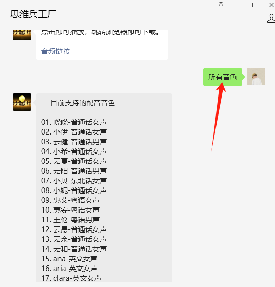
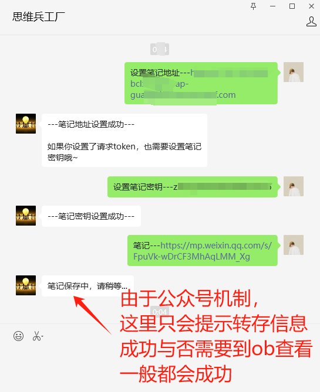
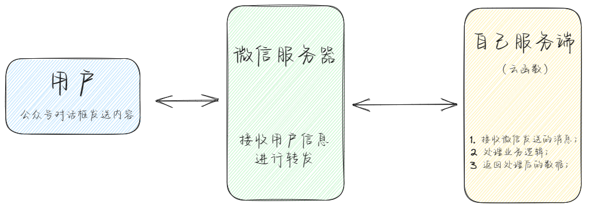

# 微信公众号开发——基于Flask框架

## 00. 项目介绍

本项目基于Flask框架实现，以微信公众号为载体，

实现一些常用功能，旨在将公众号开发为个人日常助手。

> 可以通过云函数的形式进行部署，实现最低成本运行。

- 数据库：可以使用MemFireDB的postgresql数据库(500M免费存储空间)；

- 对象存储：可以使用七牛云平台(10G免费额度)；

- 天气预报功能，调用彩云科技API；

- 文本转语音，调用微软接口；

- OCR功能，调用百度接口；

- 网页解析，调用 Jina Reader 接口；

> 因为文本转语音功能，较为耗时，所以拆分成另一个云函数。
>
> 在项目中以URL的方式进行调用（提交任务）。

目前已实现的功能有：

- AI对话；
- 天气查询；
- 签到与积分；
- 关键词回复；
- 图片转文本；
- 文本转语音；
- 网盘资源搜索；
- 文本的加密与解密；
- 微信推文、网页转存到Obsidian；

在功能的实现上，由于微信公众号平台的特殊性，将功能分成了【**指令功能**】和【**短指令功能**】，

具体见下文。

## 01. 短指令功能

以 `指令---文本---参数` 模式调用的功能，由于一条信息便能完成功能的调用，所以称之为**短指令功能**。

目前支持的短指令功能有：

- 天气查询；
- 文本转语音；
- 网盘资源搜索；
- Obsidian笔记转存；
- 文本的加密与解密；

> 其中，`---` 为分隔符，程序以此分隔用户输入的文本，将整个指令拆分成三部分：
>
> - 调用的功能；
> - 参数；
> - 需处理的文本；
>
> 该分隔符定义在配置文件中，可修改。
>
> 
>
> 【修改时需注意】：
>
> 由于加密、解密之后的文本会出现符号，应尽量选择不会与之重复的符号作为命令分隔符。

### 1.1 文本的加密与解密

**指令关键字**：【加密】【解密】。

参数可选（如不传，则使用默认key进行加密）

> 以 `---` （三个减号）分隔指令、参数和内容。


值得注意的是，加密文本得到的密文，别人即便拿到也是没法解密的，需要使用一个微信号才能实现解密。

如果希望用微信号A进行加密的内容，能够被微信号B进行解密，可以自定义加密的key，如下图：


> 加密使用的key只支持字母、数字、常见符号，不支持中文。

### 1.2 文本转语音

**指令关键字**：【文本转语音】【配音】。

参数可选（不加参数，则使用默认音色进行配音）

> - 以 `---` （三个减号）分隔指令、参数和内容。
>
> - 支持中英文配音。

输入配音命令后，会收到一个任务代号；

待后台完成文本转语音之后，输入该代号，即可拿到配音结果；

> 等待时间不定，与配音文本长度和网络状态有关；


附带参数，指定配音人选：


目前支持的配音人选有：

| 音色             | 音色                 | 音色              |
| ---------------- | -------------------- | ----------------- |
| 晓晓-普通话女声  | 小伊-普通话女声      | 云健-普通话男声   |
| 小希-普通话女声  | 云夏-普通话女声      | 云阳-普通话男声   |
| 小贝-东北话女声  | 小妮-普通话女声      | 惠艾-粤语女声     |
| 惠安-粤语女声    | 王伦-粤语男声        | 云晨-普通话女声   |
| 云余-普通话女声  | 云和-普通话女声      | ana-英文女声      |
| aria-英文女声    | clara-英文女声       | jenny-英文女声    |
| libby-英文女声   | maisie-英文女声      | michelle-英文女声 |
| molly-英文女声   | natasha-英文女声     | sonia-英文女声    |
| yan-英文女声     | christopher-英文男声 | eric-英文男声     |
| guy-英文男声     | liam-英文男声        | mitchell-英文男声 |
| roger-英文男声   | ryan-英文男声        | sam-英文男声      |
| steffan-英文男声 | thomas-英文男声      | william-英文男声  |

> 发送 `所有音色` 或 `音色` 列表，可以查看所有音色信息；
>
> 发送 `试听-音色名称` ，可试听人物音质。




### 1.3 天气查询

**指令关键字**：【天气】【天气查询】。

参数必传：输入城市、县级、区域名称；


在查询天气之后，后台会记录未来15天的天气，可以直接输入【几天(需小写数字)后天气】，查看未来天气；


### 1.4 网盘资源搜索

**指令关键字**：【搜索】【搜索资源】【资源】。

参数必传：搜索关键词；


资源链接来源于网上分享，目前收集了一万多个资源链接；

> 免责声明：如果收集到的资源链接侵犯到了您的权益，请您联系我，将第一时间删除；

### 1.5 Obsidian笔记转存

**指令关键字**：【笔记】【转存笔记】【收藏】。

参数必传：微信推文的链接，或其他网页链接；

> 这个需要您自行完成Obsidian的同步，
>
> 然后根据项目 `/script/腾讯云函数-笔记转存` 下的代码；部署另一个云函数，
>
> 再将云函数的URL记录到您的账户中；
>
> 详情请查看另一个教程~
>
> ---
>
> 关于obsidian同步，可以参考这一篇：
>
> https://mp.weixin.qq.com/s/3Gzu4seuritaANouaqowUw


当笔记地址和笔记密钥设置完成之后，就可以通过URL转存笔记到Obsidian了。



### 1.6 签到与积分

发送【签到】，可以进行签到并获取积分；连续签到会有积分奖励，最高获得10积分；

> 关于单次积分的分数，可以做配置文件中修改；
>
> 此积分可以考虑进行消费，比如资源搜索一次消耗多少积分等；


一天只能签到一次，多次签到无效；


## 02. 指令功能

使用时先输出指令关键字，待公众号回复后，再进行功能调用。

功能调用结束，需要输入“退出”或“取消”，以退出指令模式。

这种功能称之为**指令功能**。

### 2.1 图片转文本


由于公众号对于回复的文本有限制，所以，如果ocr的结果文本太长，会自动进行分页。


输入提示的命令，获取对应页数的内容。


指令功能完成之后，需输入“退出”或“取消”，以退出指令模式。


## 03. 关键词回复

项目保留了公众号原本的关键词自动回复功能；

实现的机制是：

- 在项目的 `/data` 目录下，可以创建一个 `keywords.json` 的文件，存放文本类型的关键词回复。该文件存放的数据，必须是字典格式；

文本关键词回复的数据格式：

```json
"希望用户输入的关键字": {
    "keyword": "希望用户输入的关键字",
    "content": "回复用户的文本",
    "msg_type": "text",
    "media_id": ""
}
```

语言或图片的数据格式：

如果是要回复语音或者图片，需要先将音频或图片上传到微信后台，作为永久素材，拿到 `media_id`。

```json
"希望用户输入的关键字": {
    "info": "可忽略",
    "keyword": "希望用户输入的关键字",
    "media_id": "素材豆media_id",
    "msg_type": "voice或image",
    "content": ""
}
```

- 在项目设定的数据库中，有一个 `KeyWord` 模型类；在本地关键词回复搜索无结果后，会搜索数据库中的关键词回复；

> **需要注意的是**：
>
> 在设定关键词回复的时候，设置的关键词不能包含指令调用的分割符。

## 04. AI会话功能

文本消息，如果不是指令调用或关键字回复，就会触发AI会话。

AI会话功能具有上下文信息，默认是最近8次交互的信息。

可在配置文件中修改 `history_message_limit` 的值来调整携带的历史会话数量。

## 05. 天气预报

发送位置信息，可获取该地址小时级别的天气预报。

> 默认输出未来六小时的天气情况。


## 06. 部署流程

### 6.0 克隆项目代码

将代码克隆到本地

```bash
git clone git@gitee.com:zibuyu2015831/wechat_official_pub.git
```

### 6.1 填写配置文件

在 `config/`  目录下，有一个 `demo_config.json`文件，

里面标记为xxx的项目，是需要自己填写的项目；其他可以保持默认；

修改 `demo_config.json`文件后，需要将其重命名为  `config.json`；


### 6.2 部署项目

#### 原生部署

如果使用服务器部署进行原生部署。

由于项目使用 PostgreSQL 数据库，使用到了`psycopg2`这个第三方库；

它依赖于 PostgreSQL 的 C 库 (libpq)。

其在Ubantu系统的安装命令：

```bash
sudo apt-get install libpq-dev
```

其次是根据 `requirements.txt` 安装所需依赖：

```bash
pip install -r requirements.txt
```

另外，可能需要将Flask原带的 werkzeug 替换为 uWSGI 或者 gunicorn ；以实现更好的并发处理能力。

#### 云函数部署

本项目推荐使用腾讯云的函数服务进行部署，成本最低；

项目提供了 Dockerfile 文件，可根据该文件构建docker镜像，基于镜像部署；

### 6.3 设置管理员

项目启动后，可以使用管理员命令，将自己设置为管理员，需要携带配置文件中的 `wechat_token`；

> 注意：
>
> 不要泄露配置文件；
>
> 任何人拿到配置文件中的 `wechat_token`，都可以设置自己为该公众号的管理员。


## 07. 开发笔记

### 7.1 请求流程图



> 注意：
>
> 微信官方限制，当`微信服务器` 向 `自己服务器` 发送消息时，微信服务器在五秒内收不到响应会断掉连接，并且重新发起请求，总共重试三次。
>
> 有些消息的业务处理逻辑会超过5秒钟，从而导致微信服务器接收不到响应。
>
> 本项目使用存储消息处理结果的办法：
>
> - 每次请求到来时，先查询数据库，由消息id判断该消息是否已经处理过了
>   - 如果已经处理过了，直接返回数据库中存放的处理结果；
>   - 如果没有处理过，按照程序正常处理；
> - 每次请求处理完成，将处理结果存入数据库；
> - 从而，将处理时间扩展到15秒。即15秒内能处理完成的请求，微信服务器、用户就仍能正常接收到响应。


### 7.2 备忘与计划

- 结合AI，实现自动发推文；
- 结合Obsidian，发布英语学习材料到用户笔记端；


