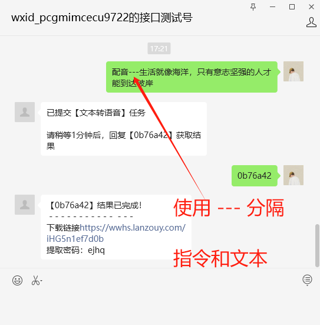
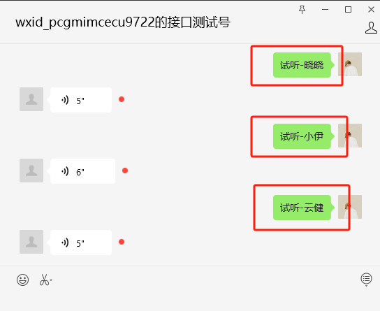
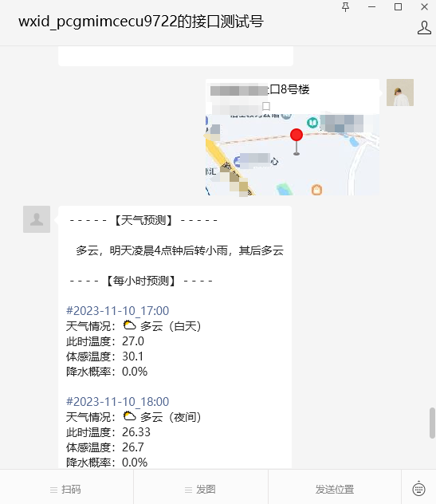
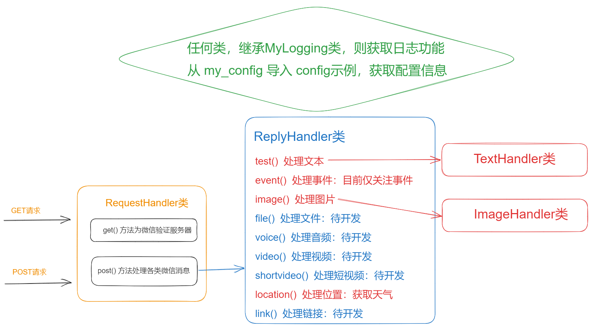

# 微信公众号开发——基于Flask框架

## 00. 项目介绍

本项目以微信公众号为载体，实现一些常用功能，旨在低成本地将公众号开发为个人日常助手。

项目基于Flask框架实现，中间消息以阿里云盘存储（低成本运营，不使用数据库），AI功能使用讯飞的星火大模型；天气预报功能调用彩云科技API；文本转语音调用微软接口。

> 因为文本转语音功能，较为耗时，拆分成一个云函数。项目中以URL的方式进行调用（提交任务）。

目前已实现的功能有：

- 文本的加密解密；
- 文本转语音；
- 图片转文本；
- 天气预报；
- AI会话；
- 上传图片获取临时链接；
- 自动转存阿里云盘链接到自己网盘；

在功能的实现上，由于微信公众号平台的特殊性，将功能分成了【指令功能】和【短指令功能】，具体见下文。

## 01. 短指令功能

以 `指令---文本---参数` 模式调用的功能，由于一条信息便能完成功能的调用，故而称之为**短指令功能**。

目前支持的短指令功能有：

- 文本的加密
- 文本的解密
- 文本转语音

> 其中，`---` 为分隔符，程序以此分隔用户输入的文本，确定调用的功能、参数和需处理的文本。
>
> 该分隔符定义在配置文件中，可修改。
>
> 修改时需注意：由于加密解密之后的文本会出现符号，应尽量选择不会与之重复的符号作为命令分隔符。

### 1.1 加密文本

指令关键字：【加密】。参数可选（如不传，则使用默认key进行加密）

> 以 `---` （三个减号）分隔指令、参数和内容。


`加密`这条指令，可以不附加参数。


### 1.2 解密文本

指令关键字：【解密】。参数可选（如不传，则使用默认key进行解密）

>  以 `---` （三个减号）分隔指令、参数和内容。


### 1.3 文本转语音

指令关键字：【文本转语音】【配音】。参数可选（不加参数，则使用默认音色进行配音）

> - 以 `---` （三个减号）分隔指令、参数和内容。
>
> - 目前仅支持中文配音，英文配音待开发。

输入配音命令后，会收到一个七位数的回复代号；

稍等一会，待后台完成文本转语音之后，输入该代号，即可拿到配音结果；

该音频存储在蓝奏云中，需自行复制链接到浏览器中下载。

（等待时间不定，与配音文本长度和网络状态有关）



附带参数，指定配音人选：


目前支持的配音人选有：

- 晓晓
- 小伊
- 云健
- 小希
- 云夏
- 云阳
- 小贝
- 小妮
- 惠艾
- 惠安
- 王伦
- 云晨
- 云余
- 云和

> 发送 `试听-音色名称` ，可试听人物音质。




## 02. 指令功能

使用时先输出指令关键字，待公众号回复后，再进行功能调用。

功能调用之后，需要输入“退出”或“取消”，以退出指令模式。

这种功能称之为**指令功能**。

### 2.1 图片转文本


由于公众号对于回复的文本有限制，所以，如果ocr的结果文本太长，会自动进行分页。


输入提示的命令，获取对应页数的内容。


指令功能完成之后，需输入“退出”或“取消”，以退出指令模式。


## 03. AI会话功能

文本消息，如果不是指令调用或关键字回复，就会触发AI会话。

AI会话功能是调用讯飞星火大模型实现的。

如果使用星火助手，则在官方后台制作好助手，获取鉴权三要素填入配置文件即可，配置文件中无需添加prompt。

如果是使用通用API，则需要在配置文件中填写prompt，且修改程序，使得优化历史会话信息的存储。

## 04. 天气预报

发送位置信息，可获取该地址小时级别的天气预报。

> 默认输出未来五小时的天气情况。



## 05. 获取图片链接

直接向公众号发送图片，可获取该图片的微信临时链接。

微信官方：临时链接的有效期是3天。

## 06. 开发笔记

### 6.1 请求流程图



### 6.2 备忘

- 微信公众号认证之后，文本信息可以携带a标签。

### 6.3 TextHandler类

#### 6.3.1 function_mapping

该函数存放调用名与方法的对应关系，开发新功能时，先书写业务处理函数，再在 `mapping_dict` 中填写对应关系，最后将关键字写入配置文件。

关于文本处理的方法，至少接收两个位置参数，第一个参数为处理的文本，第二个参数（key）为附带参数。

### 6.4 数据格式

#### 彩云科技

```python
weather_data = {
        'status': 'ok',
        'api_version': 'v2.6',
        'api_status': 'alpha',
        'lang': 'zh_CN',
        'unit': 'metric',
        'tzshift': 28800,
        'timezone': 'Asia/Shanghai',
        'server_time': 1699577296,
        'location': [39.2072, 101.6656],  # 内蒙古阿拉善
        'result': {
            'hourly':
                {
                    'status': 'ok',
                    'description': '未来24小时晴',
                    'precipitation': [  # 降水的概率与数据
                        {'datetime': '2023-11-10T08:00+08:00', 'value': 0.0, 'probability': 0},
                        {'datetime': '2023-11-10T09:00+08:00', 'value': 0.0, 'probability': 0},
                        {'datetime': '2023-11-10T10:00+08:00', 'value': 0.0, 'probability': 0}
                    ],
                    'temperature': [  # 温度
                        {'datetime': '2023-11-10T08:00+08:00', 'value': -7.0},
                        {'datetime': '2023-11-10T09:00+08:00', 'value': -1.77},
                        {'datetime': '2023-11-10T10:00+08:00', 'value': -1.33}
                    ],
                    'apparent_temperature':  # 体感温度
                        [
                            {'datetime': '2023-11-10T08:00+08:00', 'value': -10.3},
                            {'datetime': '2023-11-10T09:00+08:00', 'value': -6.5},
                            {'datetime': '2023-11-10T10:00+08:00', 'value': -6.1}],
                    'wind': [  # 地表 10 米风向与 风速
                        {'datetime': '2023-11-10T08:00+08:00', 'speed': 3.6, 'direction': 1.0},
                        {'datetime': '2023-11-10T09:00+08:00', 'speed': 12.58, 'direction': 139.93},
                        {'datetime': '2023-11-10T10:00+08:00', 'speed': 12.86, 'direction': 139.66}
                    ],
                    'humidity':  # 相对湿度
                        [
                            {'datetime': '2023-11-10T08:00+08:00', 'value': 0.47},
                            {'datetime': '2023-11-10T09:00+08:00', 'value': 0.33},
                            {'datetime': '2023-11-10T10:00+08:00', 'value': 0.31}
                        ],
                    'cloudrate': [  # 云量(0.0-1.0)
                        {'datetime': '2023-11-10T08:00+08:00', 'value': 0.17},
                        {'datetime': '2023-11-10T09:00+08:00', 'value': 0.0},
                        {'datetime': '2023-11-10T10:00+08:00', 'value': 0.0}],
                    'skycon':  # 天气现象
                        [
                            {'datetime': '2023-11-10T08:00+08:00', 'value': 'CLEAR_DAY'},
                            {'datetime': '2023-11-10T09:00+08:00', 'value': 'CLEAR_DAY'},
                            {'datetime': '2023-11-10T10:00+08:00', 'value': 'CLEAR_DAY'}],
                    'pressure':  # 地面气压
                        [
                            {'datetime': '2023-11-10T08:00+08:00', 'value': 84982.358},
                            {'datetime': '2023-11-10T09:00+08:00', 'value': 85062.358},
                            {'datetime': '2023-11-10T10:00+08:00', 'value': 85113.118}
                        ],
                    'visibility': [  # 地表水平能见度
                        {'datetime': '2023-11-10T08:00+08:00', 'value': 24.87},
                        {'datetime': '2023-11-10T09:00+08:00', 'value': 24.87},
                        {'datetime': '2023-11-10T10:00+08:00', 'value': 24.87}],
                    'dswrf': [  # 向下短波辐射通量(W/M2)
                        {'datetime': '2023-11-10T08:00+08:00', 'value': 0.0},
                        {'datetime': '2023-11-10T09:00+08:00', 'value': 52.732},
                        {'datetime': '2023-11-10T10:00+08:00', 'value': 120.161}
                    ],
                    'air_quality':
                        {
                            'aqi': [  # 国标 AQI
                                {'datetime': '2023-11-10T08:00+08:00', 'value': {'chn': 0, 'usa': 3}},
                                {'datetime': '2023-11-10T09:00+08:00', 'value': {'chn': 0, 'usa': 3}},
                                {'datetime': '2023-11-10T10:00+08:00', 'value': {'chn': 0, 'usa': 3}}
                            ],
                            'pm25': [  # PM25 浓度(μg/m3)
                                {'datetime': '2023-11-10T08:00+08:00', 'value': 0},
                                {'datetime': '2023-11-10T09:00+08:00', 'value': 0},
                                {'datetime': '2023-11-10T10:00+08:00', 'value': 0}
                            ]
                        }
                },
            'primary': 0, 'forecast_keypoint': '未来24小时晴'
        }
    }
```


#### 历史会话记录格式

示例：
```json
{
  "user_id": "ojk036kPB99gY-Ehw0rS8qVs4PgM",
  "last_msg_id": "24322210829239184",
  "last_msg_reply": "<?xml version=\"1.0\" encoding=\"utf-8\"?>\n<xml><ToUserName>ojk036kPB99gY-Ehw0rS8qVs4PgM</ToUserName><FromUserName>gh_0436edeba6fb</FromUserName><CreateTime>1698887096</CreateTime><MsgType>text</MsgType><Content>我没有获取实时日期的能力，没法回答...</Content></xml>",
  "short_command": [],
  "user_ai_talk": [
    {
      "msg_time": 1698887096,
      "msg_list": [
        {
          "role": "user",
          "content": "今天星期几？"
        },
        {
          "role": "assistant",
          "content": "我没有获取实时日期的能力，没法回答..."
        }
      ]
    }
  ]
}
```