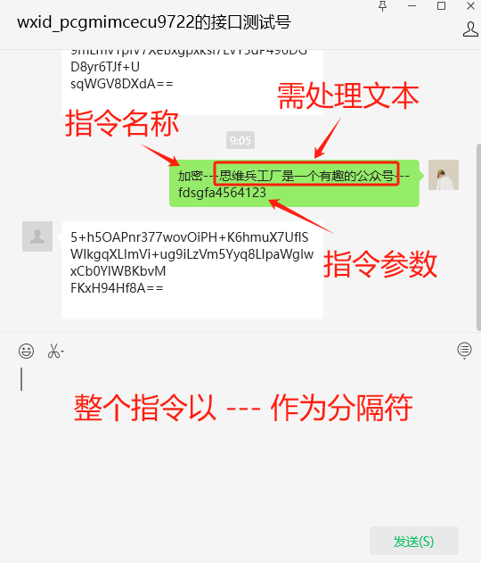
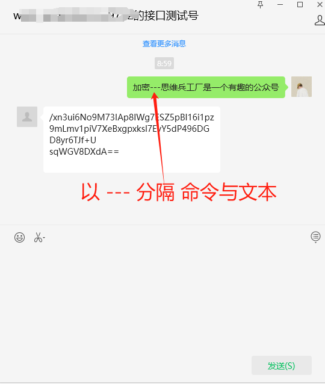
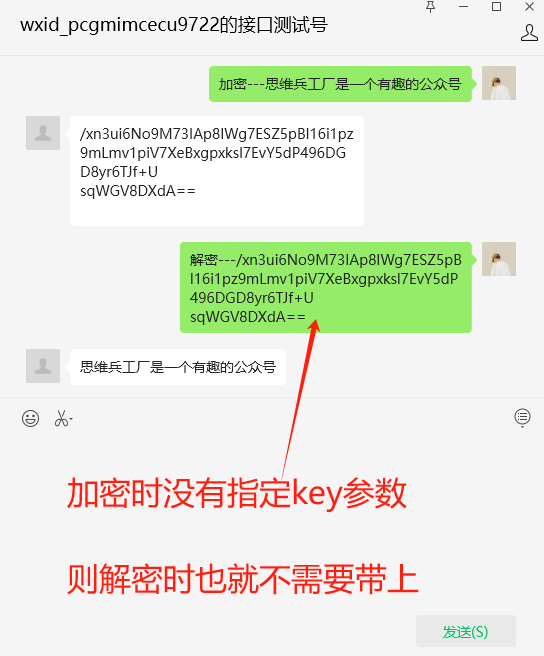
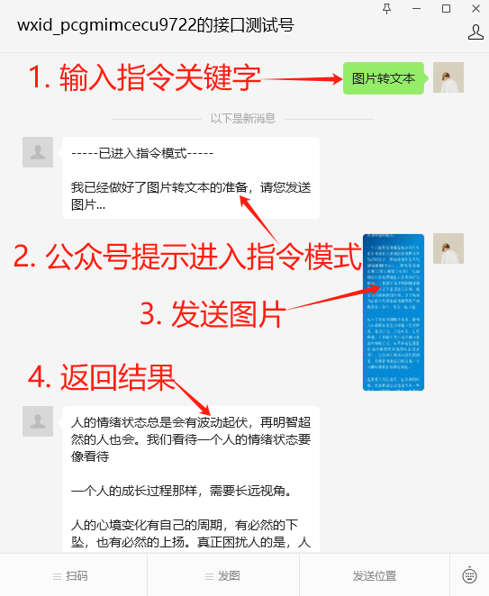
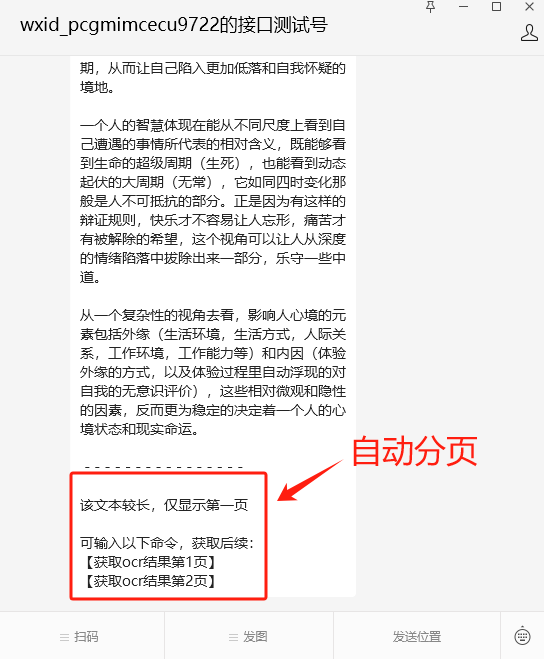
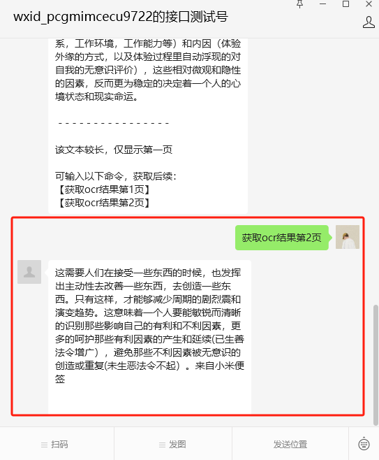
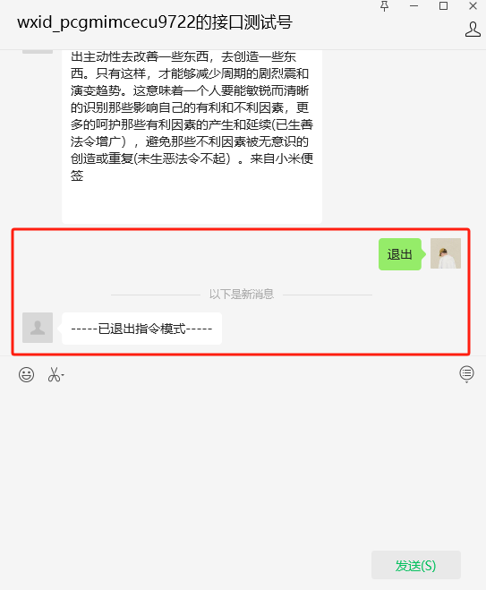

# 微信公众号开发——基于flask框架


## 01. 短指令功能

以 `指令---文本---参数` 模式调用的功能，由于一条信息便能完成功能的调用，故而称之为**短指令功能**。

目前支持的短指令功能有：

- 文本的加密
- 文本的解密
- 文本转语音

> 其中，`---` 为分隔符，程序以此分隔用户输入的文本，确定调用的功能、参数和需处理的文本。
>
> 该分隔符定义在配置文件中，可修改。
>
> 修改时需注意：由于加密解密之后的文本会出现符号，应尽量选择不会与之重复的符号作为命令分隔符。

### 1.1 加密文本

参数可选（如不传，则使用默认key进行加密）



`加密`这条指令，可以不附加参数。



### 1.2 解密文本

参数可选（如不传，则使用默认key进行解密）




### 1.3 文本转语音


## 02. 指令功能

使用时先输出指令关键字，待公众号回复后，再进行功能调用。

功能调用之后，需要输入“退出”或“取消”，以退出指令模式。

这种功能称之为**指令功能**。

### 2.1 图片转文本



由于公众号对于回复的文本有限制，所以，如果ocr的结果文本太长，会自动进行分页。



输入提示的命令，获取对应页数的内容。



指令功能完成之后，需输入“退出”或“取消”，以退出指令模式。



## 03. AI会话功能

AI会话功能是调用讯飞星火大模型实现的。

如果使用星火助手，则在官方后台制作好助手，获取鉴权三要素填入配置文件即可，配置文件中无需添加prompt。

如果是使用通用API，则需要在配置文件中填写prompt，且修改程序，使得优化历史会话信息的存储。

## 获取图片链接

直接向公众号发送图片，可获取该图片的微信临时链接。

微信官方：临时链接的有效期是3天。

## 关于text_handler.py中的TextHandler类

### 1. function_mapping

该函数存放调用名与方法的对应关系，开发新功能时，先书写业务处理函数，再在 `mapping_dict` 中填写对应关系。

关于文本处理的方法，至少接收两个位置参数，第一个参数为处理的文本，第二个参数（key）为附带参数。

## 用于会话记录

示例：
```json
{
  "user_id": "ojk036kPB99gY-Ehw0rS8qVs4PgM",
  "last_msg_id": "24322210829239184",
  "last_msg_reply": "<?xml version=\"1.0\" encoding=\"utf-8\"?>\n<xml><ToUserName>ojk036kPB99gY-Ehw0rS8qVs4PgM</ToUserName><FromUserName>gh_0436edeba6fb</FromUserName><CreateTime>1698887096</CreateTime><MsgType>text</MsgType><Content>我没有获取实时日期的能力，没法回答...</Content></xml>",
  "short_command": [],
  "user_ai_talk": [
    {
      "msg_time": 1698887096,
      "msg_list": [
        {
          "role": "user",
          "content": "今天星期几？"
        },
        {
          "role": "assistant",
          "content": "我没有获取实时日期的能力，没法回答..."
        }
      ]
    }
  ]
}
```